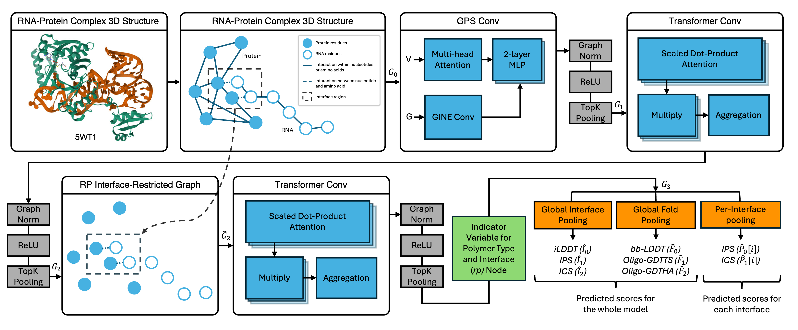

# Inferring the qualities of protein-RNA models with graph transformers
<p align="center"></p>

## Abstract
[Abstract goes here]

## Installation

CARP Conda Environment:
```
conda create -n CARP python=3.9
conda activate CARP
conda install salilab::dssp
conda install bioconda::forgi

pip install biopython==1.79
pip install torch==2.2.2 torchvision==0.17.2 torchaudio==2.2.2 --index-url https://download.pytorch.org/whl/cu118
pip install torch_geometric==2.5.2
pip install pyg_lib torch_scatter torch_sparse torch_cluster torch_spline_conv -f https://data.pyg.org/whl/torch-2.2.0+cu118
```
> [!IMPORTANT]
Update the paths in `init.py` accordingly.<br>Note each occurance (below) of `{ROOT}` should be replaced with your respective directory.

External Tools:
- Install [NetSurfP-3.0](https://services.healthtech.dtu.dk/services/NetSurfP-3.0/), then update the `NSP_ENV` & `NSP3_PATH` in `init.py` accordingly. 

- Install [IPKnot](https://github.com/satoken/ipknot), then update the `IPKNOT_PATH` in `init.py` accordingly. 

- Install [AMIGOS](https://github.com/pylelab/AMIGOS/), then update the `AMIGOS_PATH` in `init.py` accordingly. 

- Install [LinearPartition](https://github.com/LinearFold/LinearPartition/), then update the `LINEAR_PARTITION_PATH` in `init.py` accordingly. 

- Install [RNAView](https://github.com/rcsb/RNAView/), then update the `RNAVIEW_PATH` in `init.py` accordingly. 

- Install [MCAnnotate](https://major.iric.ca/MajorLabEn/MC-Tools.html):

  Download and unzip [MC-Annotate.zip](https://major.iric.ca/MajorLabEn/MC-Tools_files/MC-Annotate.zip).
  Put the MC-Annotate executable in `{ROOT}/tools/`.

  To use MC-Annotate in your current session:
  ```
  export PATH="$PATH:{ROOT}/tools"
  ```
  Alternatively, you can permanently add MC-Annotate your path:
  ```
  echo 'export PATH="$PATH:{ROOT}/tools"' >> ~/.bashrc
  source ~/.bashrc
  ```

## Usage

> [!NOTE]
Running CARP requires specific formatting for the input files

##### `target_src/` (sequence-derived features)
This directory points to the location for target-level features and reference file/s.
* Must contain `rna.fasta` and `prot.fasta`.
* Must contain monomeric protein reference `.pdb` files. We recommend using relaxed AlphaFold2 prediction/s via [ColabFold](https://github.com/sokrypton/colabfold). The file/s must match the fasta ID/s in the `prot.fasta` file.

##### `model_src/` (structure-derived features)
This directory points to the location for model-level features.
* Must contain `model.pdb`.

### Generate Features 

```
python run_tools.py -target_src {target_src} -model_src {model_src}
```

### Perform Quality Score Inference 

```
python run.py -target_src {target_src} -model_src {model_src}
```

  The CARP predicted qualities can be found @:
  > *`{model_src}/predicted_quality/carp.csv`* and *`{model_src}/predicted_quality/carp.pkl`*

### **Example** 

Fasta `prot.fasta`
```
>p0
PQYQTWEEFSRAAEKLYLADPMKARVVLKYRHSDGNLCVKVTDDLVCLVYKTDQAQDVKKIEKFHSQLMRLMVAKEARNVTMETE
>p1
VLLESEQFLTELTRLFQKCRTSGSVYITLKKYDGRTKPIPKKGTVEGFEPADNKCLLRATDGKKKISTVVSSKEVNKFQMAYSNLLRANMDGLKKRDKKNKTKKTK
```
Fasta `rna.fasta`
```
>r0
GGGCCGGGCGCGGUGGCGCGCGCCUGUAGUCCCAGCUACUCGGGAGGCUC
```

Inputs:
```
├── {target_src}/
│   ├── rna.fasta
│   ├── prot.fasta
│   ├── p0.pdb (AlphaFold2 reference prediction for sequence p0)
│   └── p1.pdb (AlphaFold2 reference prediction for sequence p1)
└── {model_src}/
    └── model.pdb
```

Outputs:
 ```
├── {target_src}/
│   ├── rna.fasta
│   ├── prot.fasta
│   ├── p0.pdb
│   ├── p1.pdb
│   ├── bp.mat
│   ├── out.bpseq
│   ├── feats.log
│   └── nsp/
│       └── 01/
│           └── 01.csv
├── {model_src}/
│   ├── model.pdb
│   ├── dssp.npy
│   ├── agged_features.npy
│   ├── feats.log
│   ├── RNAView_out/
│   │   └── ...
│   ├── forgi_out/
│   │   └── ...
│   ├── amigos_output/
│   │    └── ...
│   └── predicted_quality/
│       └── carp.csv
│       └── carp.pkl
```
### **Citation**  

[]()

